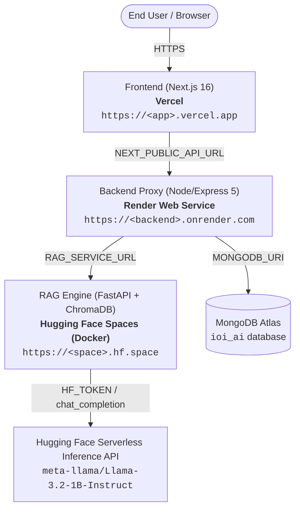

# IOI AI — Production Deployment Guide & Readiness Report

This report outlines the deployment architecture, configuration requirements, and step-by-step instructions for hosting the **IOI AI** application across its three target production platforms:

- **RAG Service**: [Hugging Face Spaces](https://huggingface.co/spaces) (Docker Container)
- **Backend API Proxy**: [Render](https://render.com) (Node/Express Web Service)
- **Frontend UI**: [Vercel](https://vercel.com) (Next.js Application)

---

## 1. System Architecture & Traffic Flow



---

## 2. Platform Breakdown & Prepared Configurations

### A. Frontend on Vercel
- **Subdirectory**: `frontend`
- **Framework Preset**: Next.js
- **Configuration File**: `frontend/vercel.json`
- **Sanitized URL Resolution**: Both `MetricsDashboard.tsx` and `RAGAssistant.tsx` automatically strip trailing slashes from `NEXT_PUBLIC_API_URL`.
- **Environment Variables**:
  | Variable | Example Value | Description |
  | :--- | :--- | :--- |
  | `NEXT_PUBLIC_API_URL` | `https://ioi-ai-backend.onrender.com` | Public base URL of your deployed Render backend |

### B. Backend on Render
- **Subdirectory**: `backend`
- **Runtime**: Node
- **Build Command**: `npm install && npm run build`
- **Start Command**: `npm start`
- **Blueprint File**: `render.yaml` at the repository root
- **Robust Client**: `backend/src/services/rag/client.ts` automatically normalizes `RAG_SERVICE_URL` (handling trailing `/` and `/api`), and injects `Authorization: Bearer <token>` headers if a token is supplied.
- **Environment Variables**:
  | Variable | Recommended Value | Description |
  | :--- | :--- | :--- |
  | `NODE_ENV` | `production` | Production mode |
  | `PORT` | `10000` | Assigned automatically by Render |
  | `CORS_ORIGIN` | `https://<your-project>.vercel.app` | Allowed origins (can use `*` initially) |
  | `MONGODB_URI` | `mongodb+srv://...` | MongoDB Atlas connection string |
  | `RAG_SERVICE_URL` | `https://<username>-ioi-ai-rag.hf.space` | Public URL of the Hugging Face Space |
  | `RAG_SERVICE_TIMEOUT_MS`| `60000` | 60-second timeout for cloud model cold starts |
  | `RAG_SERVICE_AUTH_TOKEN`| *(Optional)* | HF token if your Space visibility is set to Private |

### C. RAG Service on Hugging Face Spaces
- **Subdirectory / Source**: `rag-service` (plus `data/vectorstore_hf`)
- **Space SDK**: Docker (Blank Space)
- **Port**: `7860`
- **User**: Non-root `user:user` (UID 1000)
- **Vector Store**: Self-contained ChromaDB index with 1,097 records indexed using `sentence-transformers/all-MiniLM-L6-v2` (384 dimensions)
- **Health Endpoints**: `/`, `/health`, and `/api/health`
- **Space Metadata**: Embedded in `rag-service/README.md`
- **Space Variables & Secrets**:
  | Type | Key | Value | Description |
  | :--- | :--- | :--- | :--- |
  | **Secret** | `HF_TOKEN` | `hf_xxxxxxxxxxxxxxxxxxxx` | User Access Token with read permissions |
  | **Variable** | `EMBEDDING_PROVIDER` | `sentence-transformers` | Embeddings engine |
  | **Variable** | `EMBEDDING_MODEL` | `sentence-transformers/all-MiniLM-L6-v2` | 384d embedding model |
  | **Variable** | `LLM_PROVIDER` | `huggingface` | Provider-agnostic inference |
  | **Variable** | `HF_MODEL` | `meta-llama/Llama-3.2-1B-Instruct` | Target LLM model |
  | **Variable** | `VECTOR_STORE_PATH` | `/home/user/app/data/vectorstore_hf` | Path to container vector store |
  | **Variable** | `CORS_ORIGIN` | `*` | Allowed CORS origins |

---

## 3. Step-by-Step Deployment Procedure

Deploy in the order: **Hugging Face Spaces → Render → Vercel** so each downstream service has the URL it depends on.

---

### Step 1: Deploy RAG Service to Hugging Face Spaces

1. Create a new Space at [huggingface.co/new-space](https://huggingface.co/new-space):
   - **Space name**: `ioi-ai-rag`
   - **SDK**: **Docker** (Blank)
   - **Hardware**: **CPU Basic** (Free tier)
   - **Visibility**: Public (recommended) or Private

2. Push the RAG service and vector store to the Space:
   ```bash
   # 1. Clone the newly created HF space repository to a temp directory
   git clone https://huggingface.co/spaces/<YOUR_HF_USERNAME>/ioi-ai-rag /tmp/hf-space

   # 2. Copy the docker configuration, entrypoint, code, and MiniLM vectorstore
   cd /Users/sagargupta/Documents/ioi-ai
   cp -R rag-service/app /tmp/hf-space/
   cp rag-service/Dockerfile /tmp/hf-space/
   cp rag-service/README.md /tmp/hf-space/
   cp rag-service/requirements.txt /tmp/hf-space/
   cp rag-service/entrypoint.sh /tmp/hf-space/
   mkdir -p /tmp/hf-space/data
   cp -R data/vectorstore_hf /tmp/hf-space/data/

   # 3. Commit and push to Hugging Face
   cd /tmp/hf-space
   git add .
   git commit -m "Deploy IOI AI RAG Service container"
   git push origin main
   ```

3. Configure Space Settings:
   - Navigate to **Settings** → **Variables and secrets**.
   - Add Secret: `HF_TOKEN` with your personal token from [huggingface.co/settings/tokens](https://huggingface.co/settings/tokens).
   - Add Variables:
     - `EMBEDDING_PROVIDER` = `sentence-transformers`
     - `EMBEDDING_MODEL` = `sentence-transformers/all-MiniLM-L6-v2`
     - `LLM_PROVIDER` = `huggingface`
     - `HF_MODEL` = `meta-llama/Llama-3.2-1B-Instruct`
     - `VECTOR_STORE_PATH` = `/home/user/app/data/vectorstore_hf`

4. Verify RAG Service:
   - Wait for the Space build to finish (status changes to `Running`).
   - Open: `https://<YOUR_HF_USERNAME>-ioi-ai-rag.hf.space/api/health`
   - Expected output:
     ```json
     {
       "status": "ok",
       "service": "ioi-ai-rag-service",
       "vector_store": {
         "status": "ready",
         "indexed_records": 1097
       }
     }
     ```

---

### Step 2: Deploy Backend to Render

1. Push your repository branch to GitHub:
   ```bash
   cd /Users/sagargupta/Documents/ioi-ai
   git add .
   git commit -m "feat: configure deployment manifests for Render, Vercel, and HF Spaces"
   git push origin huggingface-deployment
   ```

2. Create the Web Service on Render:
   - Go to [dashboard.render.com](https://dashboard.render.com) → **New +** → **Web Service**.
   - Connect your GitHub repository `SagarGupta-30/ioi-ai`.
   - Settings:
     - **Name**: `ioi-ai-backend`
     - **Region**: Singapore or Oregon
     - **Branch**: `huggingface-deployment` (or `main`)
     - **Root Directory**: `backend`
     - **Runtime**: `Node`
     - **Build Command**: `npm install && npm run build`
     - **Start Command**: `npm start`
     - **Plan**: Free

3. Add Environment Variables in Render:
   - `NODE_ENV`: `production`
   - `MONGODB_URI`: `mongodb+srv://<user>:<password>@<cluster>.mongodb.net/ioi_ai`
   - `RAG_SERVICE_URL`: `https://<YOUR_HF_USERNAME>-ioi-ai-rag.hf.space`
   - `CORS_ORIGIN`: `*` (Update after deploying Vercel frontend)
   - `RAG_SERVICE_TIMEOUT_MS`: `60000`

4. Verify Backend Service:
   - Once deployed, open: `https://ioi-ai-backend.onrender.com/api/health`
   - Expected output:
     ```json
     {"status": "ok", "service": "ioi-ai-backend", "database": "connected"}
     ```

---

### Step 3: Deploy Frontend to Vercel

1. Import Project to Vercel:
   - Go to [vercel.com/new](https://vercel.com/new).
   - Select `SagarGupta-30/ioi-ai`.
   - **Framework Preset**: Next.js
   - **Root Directory**: Click *Edit* and select **`frontend`**.

2. Set Environment Variables:
   - `NEXT_PUBLIC_API_URL`: `https://ioi-ai-backend.onrender.com`

3. Deploy:
   - Click **Deploy**. Vercel will build the frontend and provide your production URL: `https://<your-project>.vercel.app`.

4. Update CORS on Render (Recommended for Security):
   - Return to the Render backend service → **Environment**.
   - Change `CORS_ORIGIN` from `*` to `https://<your-project>.vercel.app`.
   - Save changes (Render will trigger an instant zero-downtime redeploy).

---

## 4. End-to-End Verification Checklist

| Checkpoint | Target URL | Expected Result |
| :--- | :--- | :--- |
| **HF RAG Health** | `https://<YOUR_HF_USERNAME>-ioi-ai-rag.hf.space/api/health` | `status: ok`, `indexed_records: 1097` |
| **Render Backend Health** | `https://ioi-ai-backend.onrender.com/api/health` | `database: connected` |
| **Vercel Frontend Load** | `https://<your-project>.vercel.app` | UI loads student directory & chat assistant |
| **Live Natural Query** | In Vercel Chat: *"Who are some students from Bengaluru?"* | Returns 5 grounded student records with citations and latency metrics |
| **Metrics Telemetry** | `https://ioi-ai-backend.onrender.com/api/rag/metrics/summary` | Accurate query count and response times |
